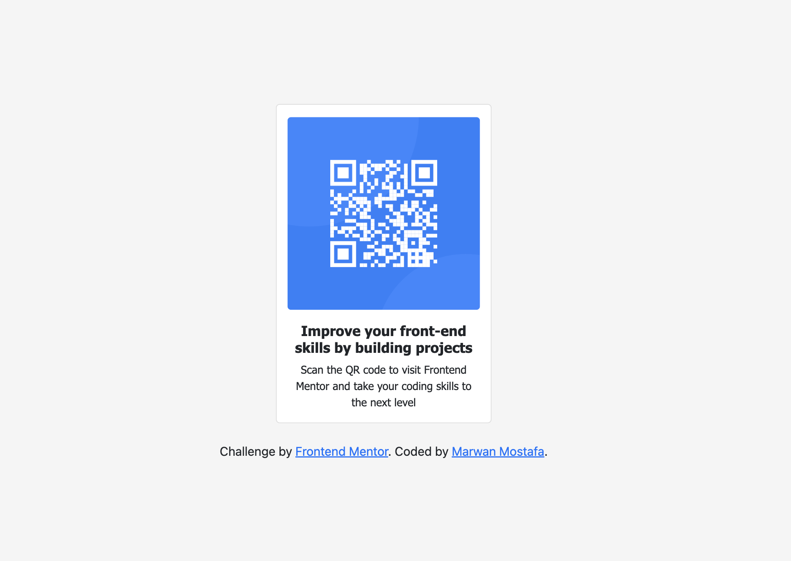

# Frontend Mentor - QR code component solution

This is a solution to the [QR code component challenge on Frontend Mentor](https://www.frontendmentor.io/challenges/qr-code-component-iux_sIO_H). Frontend Mentor challenges help you improve your coding skills by building realistic projects.

## Table of contents

- [Overview](#overview)
  - [Screenshot](#screenshot)
  - [Links](#links)
- [My process](#my-process)
  - [Built with](#built-with)
  - [What I learned](#what-i-learned)
  - [Continued development](#continued-development)
  - [Useful resources](#useful-resources)
- [Author](#author)

## Overview

### Screenshot

### Links

- Solution URL: [GitHub](https://github.com/MarwanMDev/qr-code-component)
- Live Site URL: [GitHub Pages](https://marwanmdev.github.io/qr-code-component/)

## My process

### Built with

- Semantic HTML5 markup
- CSS custom properties
- Bootstrap 5

### What I learned

Using Bootstrap 5 markup syntax and dflex components.

### Continued development

Bootstrap sass.

### Useful resources

- [Bootstrap 5](https://getbootstrap.com/docs/5.2/getting-started/introduction/) - This helped me to add components and styling. I really liked this pattern and will use it going forward.

## Author

- Website - [Marwan Mostafa](https://github.com/MarwanMDev)
- Frontend Mentor - [@MarwanMDev](https://www.frontendmentor.io/profile/MarwanMDev)
